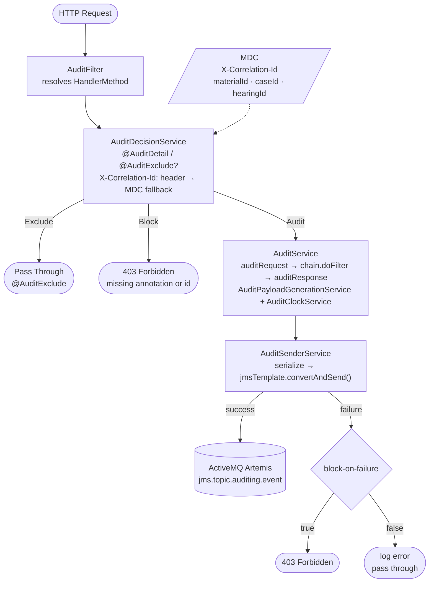

# HMCTS Audit Annotation Starter (Spring Boot 4, Java 25)

A drop-in Spring Boot **starter** that audits REST endpoints via controller annotations,
publishing structured audit events to **ActiveMQ Artemis**.

Endpoints are opted in with `@AuditDetail` and opted out with `@AuditExclude`.
Unannotated endpoints are **blocked by default** (403). `X-Correlation-Id` is resolved from
the request header first, then from MDC (set by a tracing filter upstream).

---

## Key Features

- **Annotation-driven**: no OpenAPI spec, no path-param extraction config.
- **Zero component scanning**: all beans created via a single `@AutoConfiguration`.
- **Blocks by default**: unannotated endpoints return 403 until explicitly annotated.
- **MDC-aware**: `X-Correlation-Id` and domain IDs (`materialId`, `caseId`, etc.) are read from MDC.
- **Non-blocking mode**: set `cp.audit.block-on-failure=false` to log and pass through on Artemis failure.
- **Active–Passive Artemis HA** auto-detected from host count.

---

## Building Locally

```bash
./gradlew clean build
```

The jar is produced at `build/libs/cp-audit-springboot-annotations-<version>.jar`.

---

## CI Pipeline & Publishing

Publishing to Azure Artifacts is handled entirely by CI — you do not need ADO credentials locally.

### On every push / PR to `main`

The `ci-draft.yml` workflow triggers `ci-build-publish.yml` which runs three jobs in sequence:

| Job | What it does |
|---|---|
| **Artefact-Version** | Generates a draft version number via `hmcts/artefact-version-action` |
| **Build** | Runs `./gradlew build`, uploads the jar as a GitHub Actions artifact |
| **Provider-Deploy** | Runs `./gradlew publish` using `AZURE_DEVOPS_ARTIFACT_USERNAME` and `AZURE_DEVOPS_ARTIFACT_TOKEN` from GitHub repo secrets — publishes to Azure Artifacts |

### On GitHub Release (published)

The `ci-released.yml` workflow runs the same jobs but with `is_release: true`, which produces a fixed release version number rather than a draft/snapshot.

### Where it publishes

```
https://pkgs.dev.azure.com/hmcts/Artifacts/_packaging/hmcts-lib/maven/v1
```

Group: `uk.gov.hmcts.cp` · Artifact: `cp-audit-springboot-annotations`

> The `AZURE_DEVOPS_ARTIFACT_USERNAME` and `AZURE_DEVOPS_ARTIFACT_TOKEN` secrets must be configured
> in the GitHub repository settings for publishing to succeed.

---

## Getting Started

### 1) Add the dependency

```gradle
dependencies {
    implementation 'uk.gov.hmcts.cp:cp-audit-springboot-annotations:1.0.0'
}
```

### 2) Annotate your controllers

```java
@RestController
@RequestMapping("/client-subscriptions")
public class DocumentController {

    @GetMapping("/{clientSubscriptionId}/documents/{documentId}")
    @AuditDetail(
        eventName = "hearing-results-document.get-document",
        action    = "Download",
        pathParams = { "clientSubscriptionId", "documentId" }
    )
    public ResponseEntity<byte[]> getDocument(...) { ... }

    @GetMapping("/health")
    @AuditExclude
    public ResponseEntity<String> health() { ... }
}
```

### 3) Set the `X-Correlation-Id` header

`X-Correlation-Id` is resolved from the request header first, then from MDC — so if your
tracing filter (e.g. `TracingFilter` with `@Order(HIGHEST_PRECEDENCE)`) puts it in MDC,
clients do not need to set it explicitly. Requests where it cannot be found in either are blocked with 403.

### 4) Populate MDC for domain IDs (optional)

Domain-specific IDs are read from MDC on the **response** event. Set them in your service layer:

```java
MDC.put(AuditMdcKeys.MATERIAL_ID,       materialId.toString());
MDC.put(AuditMdcKeys.CASE_ID,           caseId.toString());
MDC.put(AuditMdcKeys.HEARING_ID,        hearingId.toString());
MDC.put(AuditMdcKeys.COURT_DOCUMENT_ID, courtDocumentId.toString());
```

### 5) Minimal configuration

```yaml
cp:
  audit:
    hosts:
      - artemis-primary.internal
      - artemis-secondary.internal   # optional — two hosts enables HA automatically
```

---

## How It Works



`ArtemisAuditAutoConfiguration` creates:

- `ActiveMQConnectionFactory` with HA URL and hard-coded connection tuning (port 61616, infinite reconnect, exponential back-off).
- `JmsTemplate` (topic mode, persistent delivery).
- `ObjectMapper` with JavaTimeModule.
- `AuditDecisionService` — evaluates `@AuditDetail` / `@AuditExclude` and checks `X-Correlation-ID`.
- `AuditPayloadGenerationService` — builds the structured JSON payload from the annotation and MDC.
- `AuditSenderService` — publishes to `jms.topic.auditing.event`.
- `AuditService` — orchestrates decision → payload → send.
- `AuditFilter` — resolves the Spring MVC handler method and delegates to `AuditService`.

**Decision logic per request:**

| Condition | Outcome |
|---|---|
| Method/class annotated `@AuditExclude` | Pass through, no audit |
| Method/class annotated `@AuditDetail`, `X-Correlation-Id` in header or MDC | Audit request + response |
| Method/class annotated `@AuditDetail`, `X-Correlation-Id` missing from both | 403 |
| No annotation | 403 |

---

## `@AuditDetail` Reference

| Attribute | Default | Purpose |
|---|---|---|
| `eventName` | *(required)* | Event name in the audit payload (e.g. `"my-service.get-item"`). |
| `origin` | `"hearing-results-document"` | Service identifier in the audit envelope. |
| `component` | `"QUERY_API"` | Component identifier in the audit envelope. |
| `action` | `"View"` | Action label (e.g. `"Download"`, `"View"`). |
| `pathParams` | `{}` | Path variable names to extract from the URI and include in the payload. |

---

## Configuration Reference

### `cp.audit.*`

| Property | Type | Default | Purpose |
|---|---|---|---|
| `cp.audit.enabled` | boolean | `true` | Set `false` to disable auditing (e.g. in tests). A `WARN` is logged on startup when disabled. |
| `cp.audit.block-on-failure` | boolean | `true` | Set `false` to log and pass through on Artemis failure instead of returning 403. Useful in environments where the broker may be flaky. |
| `cp.audit.hosts` | list\<string\> | *(required)* | One or more Artemis broker hostnames. Two hosts enables HA automatically. |

All other connection parameters (port, credentials, SSL, retries, timeouts) are hard-coded in
`ArtemisAuditAutoConfiguration` and are not configurable.

---

## Environment Setup

### Local / Dev (no broker — disable auditing)

```yaml
cp:
  audit:
    enabled: false
```

A `WARN` is logged on startup so it is visible in test output.

### Non-prod (single broker)

```yaml
cp:
  audit:
    hosts:
      - artemis-broker.internal
```

### Production (HA — two brokers)

```yaml
cp:
  audit:
    hosts:
      - artemis-primary.internal
      - artemis-secondary.internal
```

HA is enabled automatically when two hosts are provided.

---

## Testing Guidance

### Required test configuration

The starter requires `cp.audit.hosts` to be set or it will throw on startup.

**`src/test/resources/application.properties`** — add a dummy host and exclude conflicting JMS auto-config:

```properties
cp.audit.hosts=localhost
spring.autoconfigure.exclude=org.springframework.boot.jms.autoconfigure.JmsAutoConfiguration,org.springframework.boot.jms.autoconfigure.ArtemisAutoConfiguration
```

The `spring.autoconfigure.exclude` prevents Spring Boot's own JMS auto-configuration from
conflicting with the starter's `auditConnectionFactory` bean.

**Helm values** — set the real broker hosts for each environment:

```yaml
java:
  environment:
    CP_AUDIT_HOSTS_0: artemis-primary.internal
    CP_AUDIT_HOSTS_1: artemis-secondary.internal   # optional — enables HA
```

These map to `cp.audit.hosts[0]` and `cp.audit.hosts[1]` via Spring Boot's relaxed binding.

### Mocking the sender

Mock `AuditSenderService` to verify audit events without a real broker:

```java
@SpringBootTest
@AutoConfigureMockMvc
class MyControllerAuditTest {

    @Autowired MockMvc mockMvc;
    @MockitoBean AuditSenderService auditSenderService;

    @Test
    void annotated_endpoint_should_produce_two_audit_events() throws Exception {
        mockMvc.perform(get("/my-endpoint/123")
                .header("X-Correlation-Id", "00000000-0000-0000-0000-000000000001"))
                .andExpect(status().isOk());

        verify(auditSenderService, times(2)).send(any());
    }
}
```

---

## HA

When two hosts are configured the starter builds a failover URL automatically:

```
tcp://brokerA:61616?ha=true&reconnectAttempts=-1&...,
tcp://brokerB:61616?ha=true&reconnectAttempts=-1&...
```

No extra configuration is required — HA is detected from host count.

---

## License

MIT — see [LICENSE](LICENSE).
