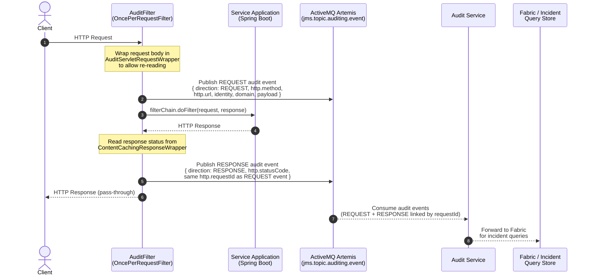

# Audit Filter — Request / Response Flow

> Shows how the `cp-audit-filter-springboot` library intercepts HTTP traffic and publishes
> audit events to the ActiveMQ Artemis topic, which the downstream Audit service then
> forwards to Fabric for incident queries.

---

---

## Event Linking

The `http.requestId` field (a UUID generated once per HTTP request) is stamped on **both** the
REQUEST and RESPONSE events. This is the key that allows the Audit service to correlate the
two events into a single interaction record.

---

## What This Library Owns

| Concern | Owner |
|---|---|
| Intercepting HTTP traffic | `AuditFilter` (`OncePerRequestFilter`) |
| Building the audit payload | `AuditPayloadGenerationService` |
| Publishing to Artemis | `AuditEventPublisher` |
| Body buffering (request) | `AuditServletRequestWrapper` |
| Body buffering (response) | `ContentCachingResponseWrapper` |
| Path param extraction | OpenAPI spec + `OpenApiPathParamExtractor` |
| PII suppression switch | `audit.http.include-payload-body` config property |

## What This Library Does Not Own

| Concern | Owner |
|---|---|
| Consuming from the Artemis topic | Audit Service |
| Forwarding to Fabric | Audit Service |
| Incident query interface | Fabric / downstream |
